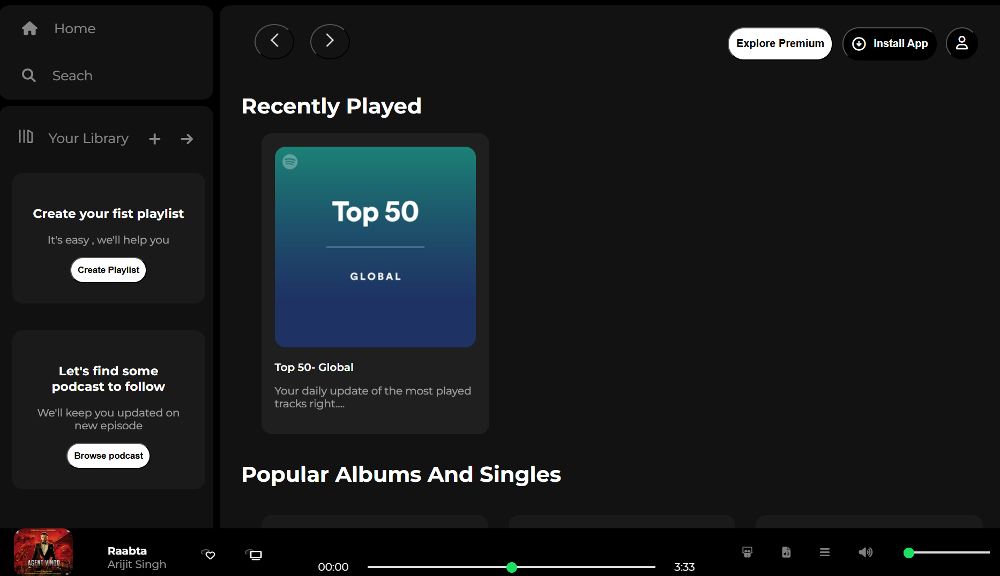
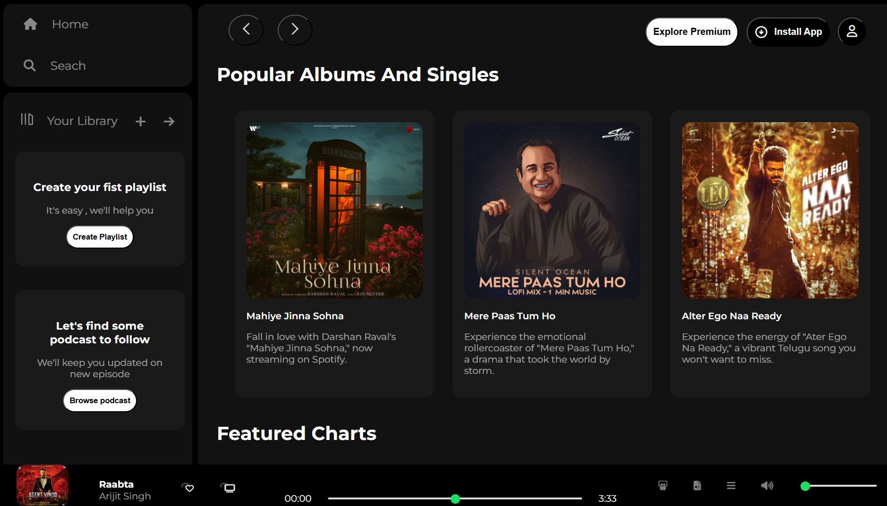
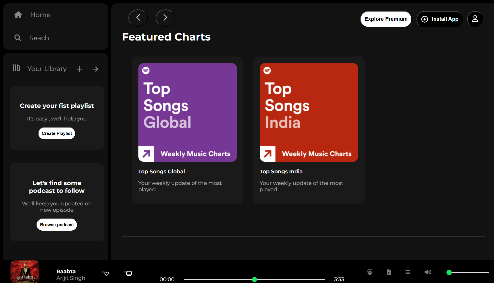

# 🎧 Spotify Clone

A **modern web replica of Spotify's UI** built entirely with **HTML and CSS**.  
This project focuses on **design, layout, and responsiveness**. No backend or real music playback is included — purely a **frontend visual experience**.  

---

## 🌟 Features

- 🎵 **Sidebar navigation**: Home, Search, and Your Library  
- 💿 **Cards for playlists, albums, and podcasts**  
- 🖤 **Dark aesthetic design** similar to Spotify Web Player  
- 🎛️ **Music player interface** with track progress and volume controls  
- ✨ Hover effects and smooth transitions for interactive feel  
- 📱 Responsive layout for medium & large screens  

---

## 🖼 Preview

 
 
 

## 🧩 Tech Stack
- **HTML5** — Semantic markup  
- **CSS3** — Flexbox, Grid, transitions, hover effects, gradients, shadows  
- **Font Awesome & Material Icons** — For icons and UI elements  
- **Google Fonts** — Montserrat (clean, modern typography)  

## 🔮 Future Enhancements

🔹 *JavaScript Integration* – &nbsp;To enable actual music playback. 
🔹 *API Integration* –&nbsp;Fetch real-time song data from the Spotify API. 
🔹 *Advanced Responsiveness* –&nbsp; Further optimize UI for all devices. 
🔹 *Dark & Light Modes* –&nbsp; Allow users to switch between themes for better user experience. 
🔹 *Playlist Management* – &nbsp;Add functionality to create, edit, and manage playlists dynamically. 

Made with ❤ *by Arunima Satpathy*
